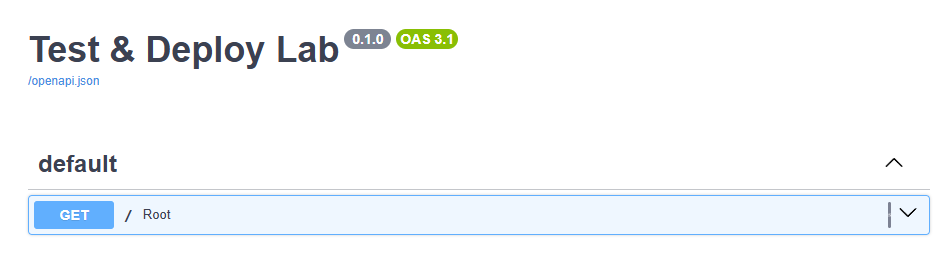
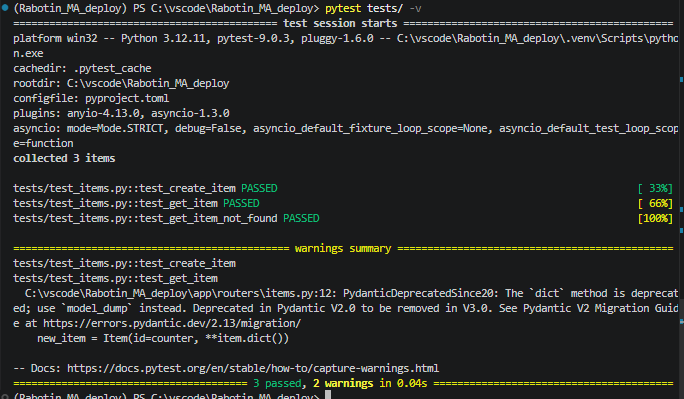
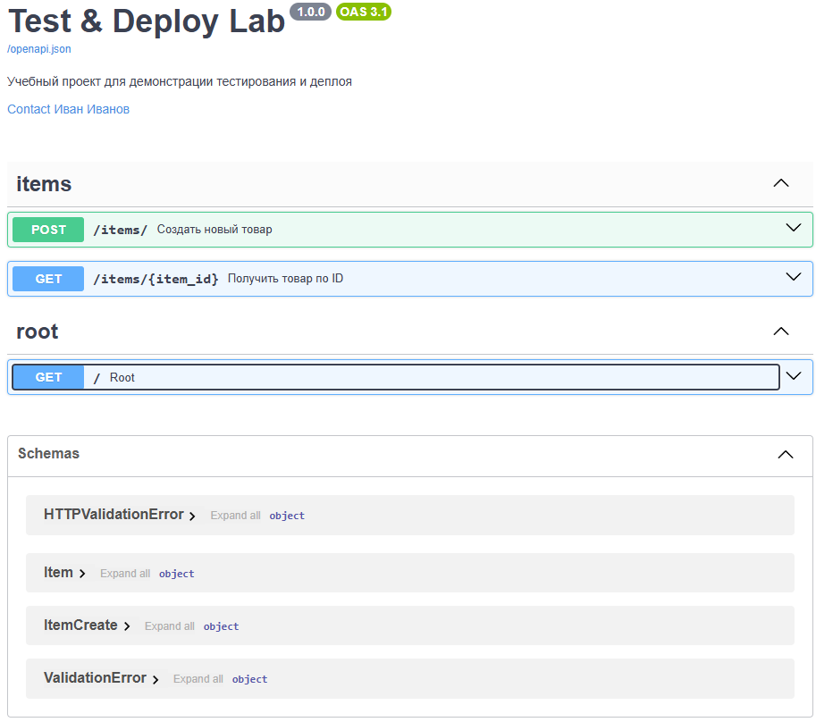
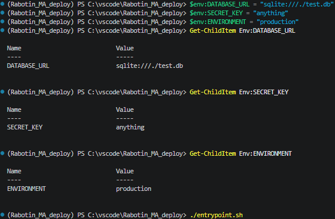
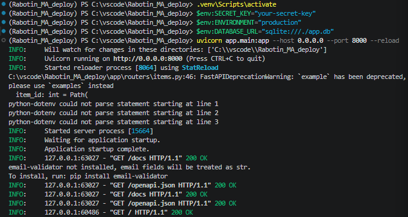
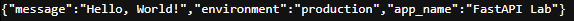
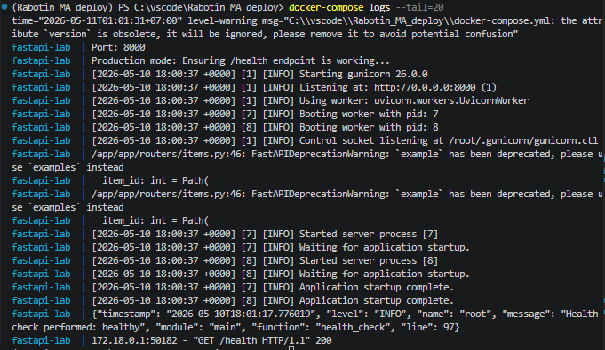

# Лабораторная работа: Тестирование, документирование и развёртывание FastAPI

## Выполнил: Работин М.А.

## Выполненные задания

### Задание 0. Подготовительный этап
- Создана структура проекта
- Настроен `uv` для управления зависимостями
- Создано базовое FastAPI приложение
- 
- **Коммит**: `init: базовое FastAPI приложение`

### Задание 1. Тестирование с pytest
- Добавлен CRUD для товаров (app/schemas.py, app/routers/items.py)
- Созданы тесты в tests/conftest.py и tests/test_items.py
- Запущены тесты: pytest tests/
- 
- **Коммит**: `feat: добавлены CRUD эндпоинты и тесты pytest`

### Задание 2. Документирование API
- Дополнены метаданные приложения в app/main.py
- Добавлены summary, description, response_description в роутере items.py
- Использованы Path и Query для параметров
- Добавлен Field в Pydantic-схемы (title, description, example)
- Добавлен тег "items"
- Прописаны возможные ответы для эндпоинта POST /items/
- Проверено в браузере: http://localhost:8000/docs
- 
- **Коммит**: `docs: улучшена документация OpenAPI`

### Задание 3. Подготовка к деплою
- Дополнен app/config.py (database_url, secret_key)
- Создан .env с SECRET_KEY
- Изменен app/main.py для использования settings
- Установлен gunicorn: uv add gunicorn
- Создан entrypoint.sh и сделан исполняемым
- Проверен локальный запуск
- 
- **Коммит**: `build: добавлены production-настройки и gunicorn`

### Задание 4. Контейнеризация с Docker
- Создан Dockerfile (многостадийная сборка с uv)
- Создан .dockerignore
- Создан docker-compose.yml
- Собран образ и запущен контейнер
- 
- 
- **Коммит**: `docker: добавлена контейнеризация приложения`

### Задание 5. Подготовка к деплою (продолжение)
- Добавлен healthcheck эндпоинт /health
- Healthcheck используется в docker-compose.yml
- Добавлено структурированное JSON-логирование в файл
- Настроен Gunicorn с переменным числом воркеров (переменная GUNICORN_WORKERS)
- 
- **Коммит**: `feat: добавлен healthcheck эндпоинт и JSON логирование`

### Задание 6. Добавление отчёта
- Создан файл README.md со скриншотами выполнения
- **Коммит**: `docs: добавлен отчёт по лабораторной работе`

## Инструкция по запуску

```bash
# Клонирование репозитория
git clone <repository-url>
cd rabotin_ma_deploy

# Установка зависимостей
uv venv
source .venv/bin/activate
uv add fastapi uvicorn pydantic-settings
uv add --dev pytest httpx pytest-asyncio
uv add gunicorn

# Запуск в режиме разработки
uvicorn app.main:app --reload

# Запуск тестов
pytest tests/ -v

# Запуск через Docker
docker-compose up -d --build

# Проверка healthcheck
curl http://localhost:8000/health

# Просмотр документации
open http://localhost:8000/docs